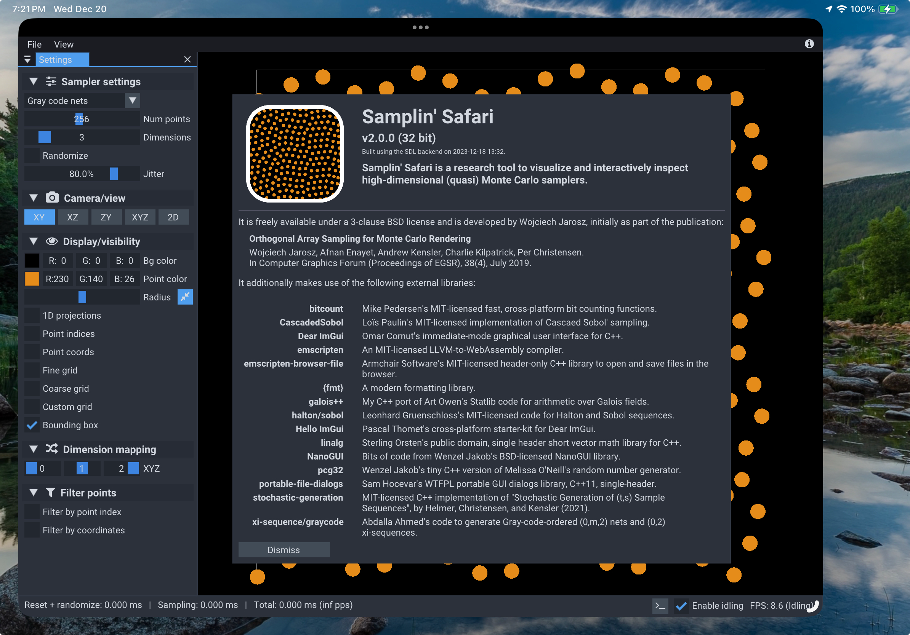
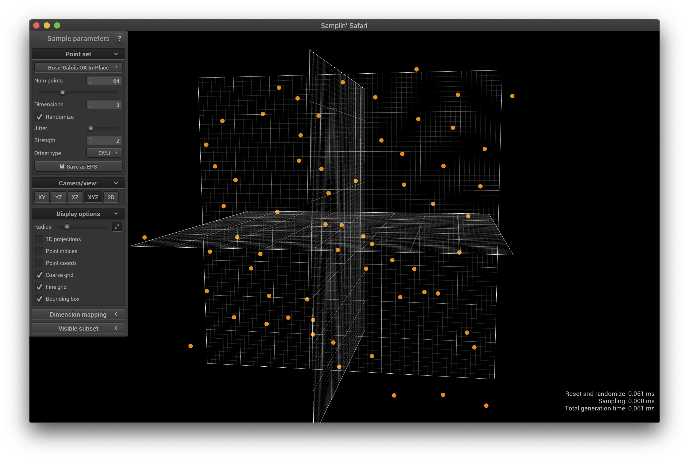
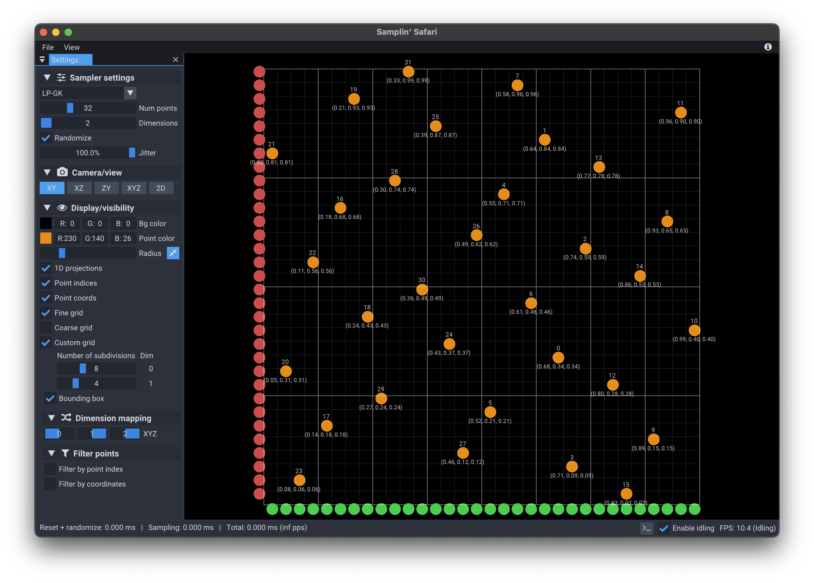

# Samplin' Safari

[](https://github.com/wkjarosz/SamplinSafari/actions/workflows/ci-mac.yml)
[](https://github.com/wkjarosz/SamplinSafari/actions/workflows/ci-linux.yml)
[](https://github.com/wkjarosz/SamplinSafari/actions/workflows/ci-windows.yml)
[](https://wkjarosz.github.com/SamplinSafari)

Samplin' Safari is a research tool to visualize and interactively inspect high-dimensional (quasi) Monte Carlo samplers.

It was initially developed as part of the publication:

> **Orthogonal Array Sampling for Monte Carlo Rendering**<br/>
> Wojciech Jarosz, Afnan Enayet, Andrew Kensler, Charlie Kilpatrick, Per Christensen<br/>
> In *Computer Graphics Forum (Proceedings of EGSR), 38(4), July 2019*<br/>
> [Project page](https://cs.dartmouth.edu/~wjarosz/publications/jarosz19orthogonal.html)
> [PDF](https://cs.dartmouth.edu/~wjarosz/publications/jarosz19orthogonal.pdf)

and now released under the 3-clause BSD license. For details, see the [LICENSE](LICENSE) file.

## Screenshots

<figure>
  <figcaption>Samplin' Safari running inside a web browser on an iPad (click the image to try it out yourself):</figcaption>
  <a href="https://wkjarosz.github.io/SamplinSafari"></a>
</figure>

<figure>
  <figcaption>Viewing all 2D projections of a 6D point set:</figcaption>
  
</figure>

<figure>
  <figcaption>Viewing the 3rd, 5th, and 6th dimenions of a 6D point set in 3D:</figcaption>
  
</figure>

<figure>
  <figcaption>Visualizing the point indices, coordinates, and drawing a custom grid to validate the stratification of the point sets:</figcaption>
  
</figure>

## Features

<!-- ### Supported samplers

* [Independent random](include/sampler/Random.h)
* [Regular grid and Jittered](include/sampler/Jittered.h)
* [(Correlated) Multi-jittered](include/sampler/MultiJittered.h)
* [Orthogonal Arrays](include/sampler/OA.h#L20)
    * [Bose construction](include/sampler/OABose.h)
    * [Bush construction](include/sampler/OABush.h)
    * [Bose-Bush construction](include/sampler/OABoseBush.h)
    * [Addelman-Kempthorne construction]((include/sampler/OAAddelmanKempthorne.h))
* [N-Rooks (Latin hypercubes)](include/sampler/NRooks.h)
* [Sobol'](include/sampler/Sobol.h)
* [XORed/shuffled (0,2) sequence](include/sampler/Sobol.h#L40)
* [Halton (Zaremba)](include/sampler/Halton.h)
* [Hammersley (Zaremba)](include/sampler/Hammersley.h)
* [Larcher-Pillischammer (with Gruenschloss-Keller extension to 3D)](include/sampler/LP.h) -->

<!-- ## Additional features -->
* interactively switching samplers, setting number of samples, dimensions, and various sampler parameters
* 3D and 2D orthographic views for X, Y and Z dimensions
* view of all 2D projections (useful for high-dimensional samples)
* custom mapping of any (higher) dimensions to X, Y or Z
* save all of these views as vector EPS or SVG files
* save and load points to/from CSV text files
* show point index and point coordinates
* show stratification grids
* displaying only a subset of points, either by subsetting on sample index, or sample coordinates.

## Running Samplin' Safari

The easiest way to try out Samplin' Safari is to load up the web version [by following this link](https://wkjarosz.github.io/SamplinSafari).

Alternatively, you can check out the [latest release](https://github.com/wkjarosz/SamplinSafari/releases/latest) for precompiled binaries for various platforms.

## Building

Assuming you have CMake and a C++17 toolchain, compiling should be as simple as (dependencies are automatically downloaded via [CPM.cmake](https://github.com/cpm-cmake/CPM.cmake) so you will need an active internet connection during cmake configure):

```shell
git clone https://github.com/wkjarosz/SamplinSafari.git
cd SamplinSafari
mkdir build
cd build
cmake ../
cmake --build . -j 4
```
## Acknowledgements

Samplin' Safari was primarily developed by Wojciech Jarosz though it depends on a number of external libraries and techniques, as listed on the in-app about dialog.